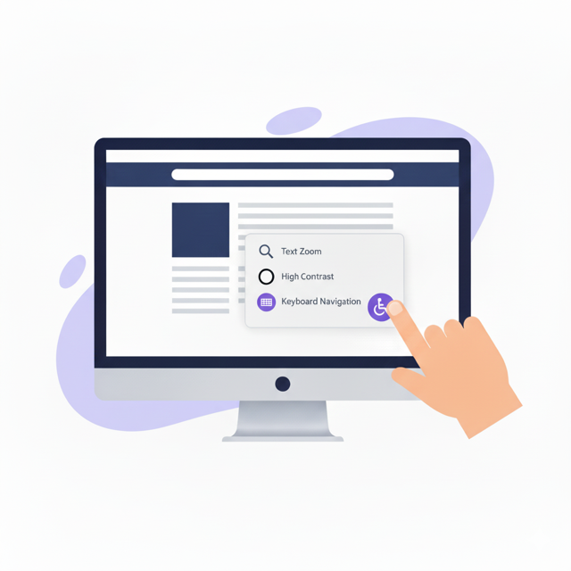

# 👩‍🦽 NextBility: Accessibility Widget for Websites

NextBility: accessibility widget for websites. easy to install, just copy and paste the plugin. Fast performance with lightweight plugin (~30kb).

## 🎉 Getting Started
[View Demo](https://nextbility.biz.id)

## 🧪 Local Testing
- Install dependencies: `npm install`
- Build the widget bundle: `npm run build`
- Start the demo server (serves `demo/index.html` plus the `dist` bundle): `npm run demo`
- For hot reload, run `npm run demo:serve` (watches the build and restarts the server automatically).
- Open `http://127.0.0.1:4173/` in Chrome/Edge to exercise screen reader, voice navigation, widget positioning, and custom language registration.

## 🚀 Features

✅ **Multilingual Support**: Supports multiple languages to ensure a seamless user experience for all users.

✅ **Dyslexia Font**:  Dyslexia font to make reading easier for dyslexic users.

✅ **Adjustable Font Size and Highlighting Text**: Users can easily adjust the font size and highlight text to their liking, making it easier to read content.

✅ **Color Adjustments, Contrast, Saturation, and Monochrome**: Allows users to customize the color scheme of your website, making it easier for them to read and navigate.

✅ **Reading Guide, Stop Animations, and Big Cursor**: Helpful tools like a reading guide, the ability to stop animations, and a big cursor to make browsing your website easier for users with visual impairments.

## 📌 TODO
- Accessibility Profiles
- Widget Settings
  - Widget Size (Default, Medium, Small)

## 🤝 Contributing
We welcome contributions from anyone who is interested in improving this. If you would like to contribute, please fork the repository and submit a pull request. ❤️

## 🎓 License
NextBility is released under the MIT License
